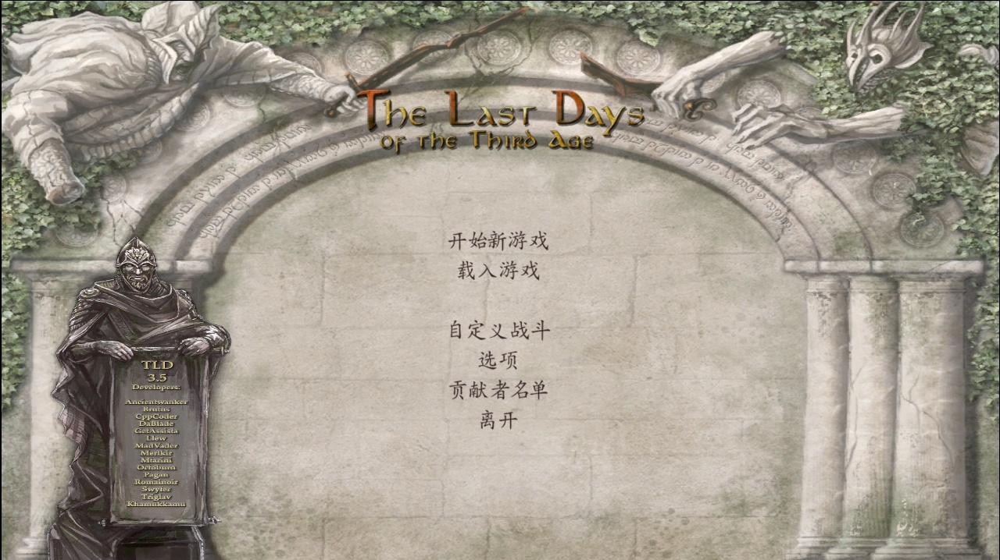
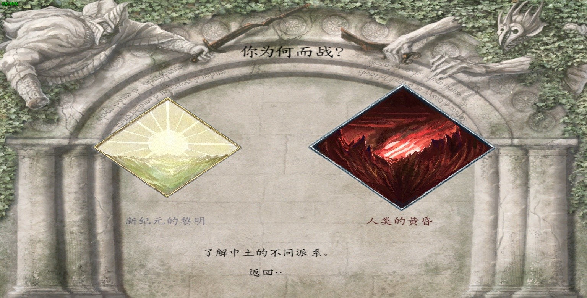
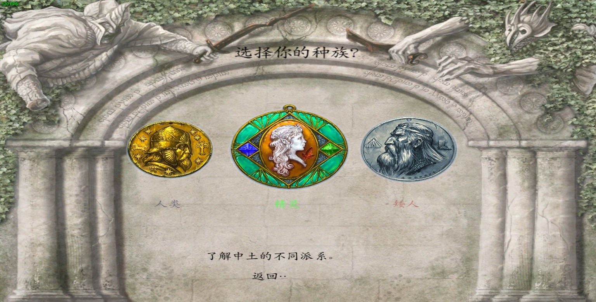
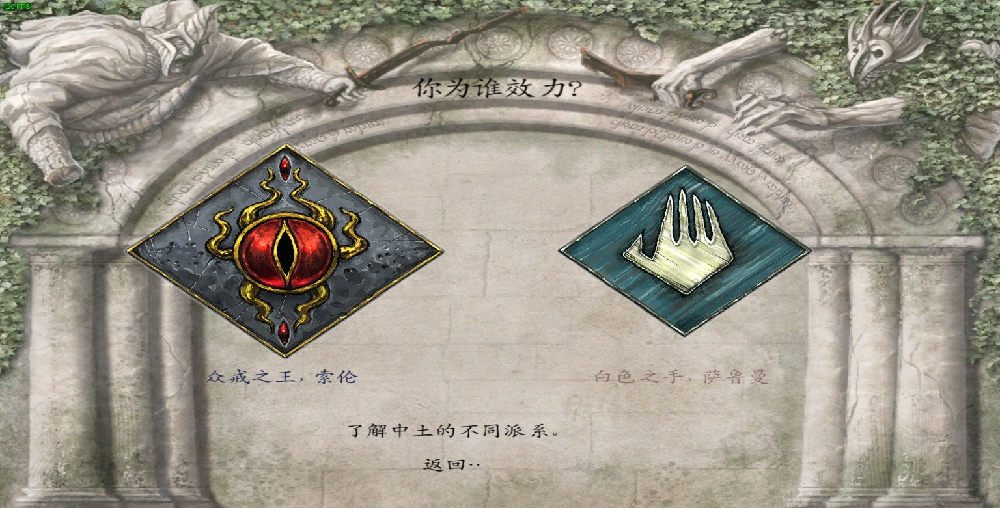
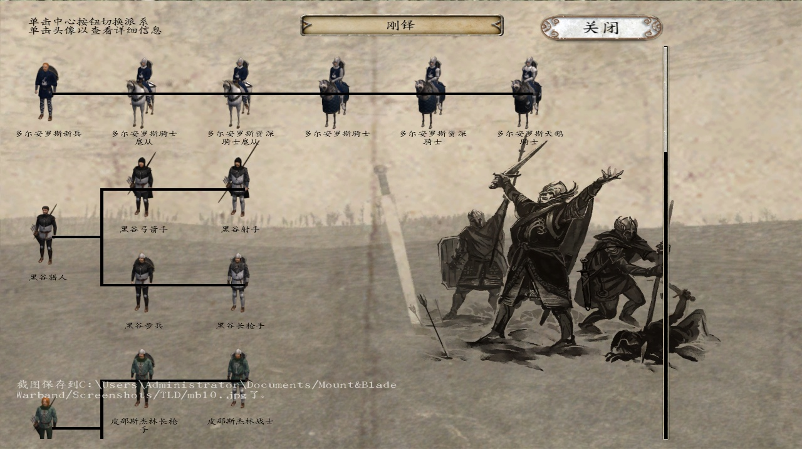
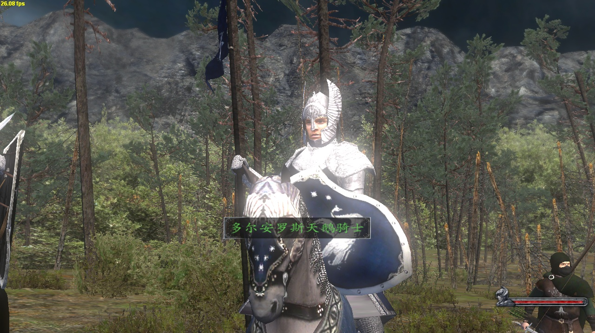

# 汉化

## 这个世界需要更多的英雄

欢迎加入TLD汉化项目：[项目概览 - The Last Days - ParaTranz](https://paratranz.cn/projects/34)

## 下载

| 载点   | 链接                                                                                                 | 提取码  |
| ---- | -------------------------------------------------------------------------------------------------- | ---- |
| 百度网盘 | [https://pan.baidu.com/s/1KaKiYXHoACLsoaFZPRmepQ](https://pan.baidu.com/s/1KaKiYXHoACLsoaFZPRmepQ) | xh7p |

## 使用说明

1.  下载汉化包，将解压得到的文件放到TLD里覆盖

    （steam创意工坊下载的TLD在“SteamLibrary\steamapps\workshop\content\48700\299974223”）
2. 删除TLD\Data内的font_data.xml，以及Textures内的font.dds
3.  同时为了正确显示中文字体，还需要修改core_shaders.brf文件（DX7玩家不需要） 

    修改方法：[【修改】TLD中文字体解决方案](https://bbs.mountblade.com.cn/thread-1905736-1-1.html)

    在这里提供已经修改好的下载，有需要自取

| 载点   | 链接                                                                                                 | 提取码 |
| ---- | -------------------------------------------------------------------------------------------------- | --- |
| 百度网盘 | [https://pan.baidu.com/s/1dRzubsRWIAF7glLULAXY3A](https://pan.baidu.com/s/1dRzubsRWIAF7glLULAXY3A) | 2aj |

## 会遇到的问题

* ~~一些未翻译内容和机翻~~（如果会遇到未翻译内容，要么是故意的，要么是新更新的东西；如果感觉有机翻的，一般是刚开始翻译没什么经验的部分，还没翻新到的地方，比如Q键日志里的和部分派系的介绍）
* ~~第一次跟领主对话出现UNRECOGNIZED TOKEN~~（字符问题）
* ~~战斗后的结算界面，部分受伤兵种会出现UNRECOGNIZED TOKEN，具体原因暂时未知~~（变量漏了个字符）

## 截图预览















## 答谢

### 人员

#### TLD  3.5  r2406

* _**yuwenlan**_
* 今天手气不错啊
* a029384756
* Nsrfc
* 风轻牧梦
* 及Transifex里的其他成员  [Chinese Simplified 翻译团队](https://www.transifex.com/tld/teams/5889/zh-Hans/)

#### \~最新

* _dunnish-reiter_
* _Moranhere_
* _Bombadil_
* Borondir-Udalraph
* 及ParaTranz里的其他成员 [成员 - ParaTranz](https://paratranz.cn/projects/34/members)

### 站点

*  TLD制作组在 [Transifex](https://www.transifex.com/tld/tld/dashboard/) 发起本地化项目
*  [**ParaTranz**](https://paratranz.cn/projects) 及其站长 **机智的布鲁斯** 的大力支持

## 更新记录

小变动就不赘述了。
